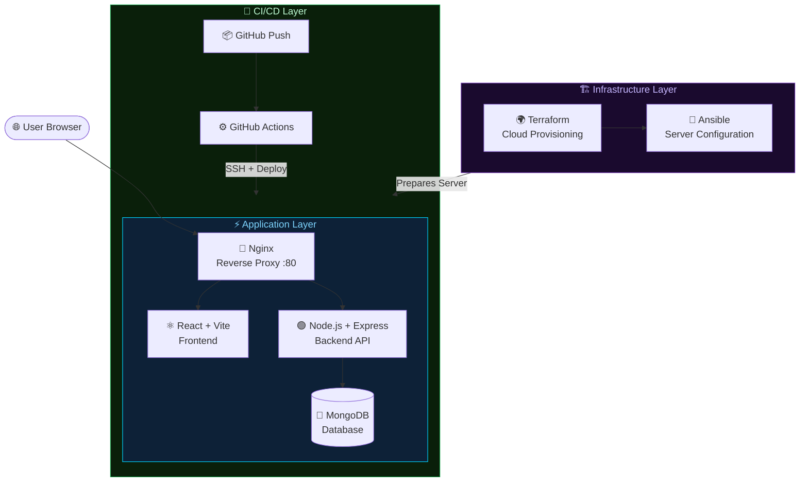
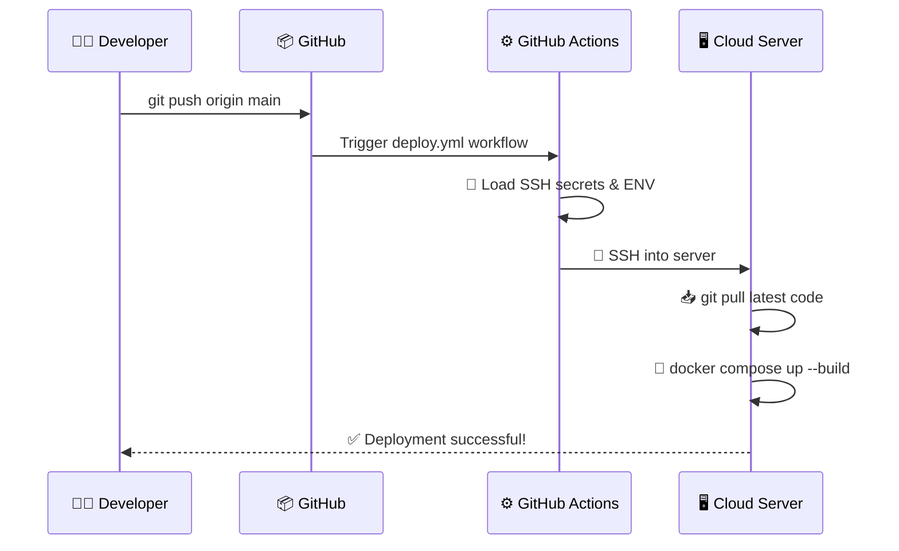

<div align="center">


<br/>

<p>
  
  
  
  
  
</p>
<p>
  
  
  
  
  
</p>

<br/>

<p>
  
  &nbsp;
  
  &nbsp;
  
  &nbsp;
  
  &nbsp;
  
</p>

<br/>

<blockquote>
<b>DockStack</b> is a production-grade DevOps platform that simplifies containerized deployments using Docker, Nginx, Terraform, Ansible, and GitHub Actions — all wired into one centralized pipeline.
</blockquote>

</div>

---

## 📌 Table of Contents

- [🚨 Problem Statement](#-problem-statement)
- [💡 Solution](#-solution)
- [🏗️ System Architecture](#️-system-architecture)
- [🧰 Tech Stack](#-tech-stack)
- [📁 Project Structure](#-project-structure)
- [⚙️ Installation & Setup](#️-installation--setup)
- [🐳 Docker Setup](#-docker-setup)
- [☁️ Infrastructure – Terraform](#️-infrastructure-setup-terraform)
- [🤖 Server Config – Ansible](#-server-configuration-ansible)
- [🔄 CI/CD Pipeline](#-cicd-pipeline)
- [🔐 Authentication](#-authentication)
- [📊 Features](#-features)
- [🔮 Future Improvements](#-future-improvements)
- [👨‍💻 Author](#-author)
- [🤝 Contributing](#-contributing)

---

## 🚨 Problem Statement

Modern application deployment involves multiple steps and tools. Managing them manually is **time-consuming, error-prone, and overwhelming** — especially for developers new to DevOps.

<div align="center">

| ❌ Pain Point | 😩 Impact |
|:-------------|:---------|
| Manual Docker container setup | Time wasted on repetitive config |
| Complex server configuration | High chance of human error |
| No centralized deployment management | Scattered tools, no visibility |
| Difficult CI/CD pipeline setup | Slow release cycles |
| Managing multiple services & environments | Inconsistent deployments |

</div>

---

## 💡 Solution

**DockStack** provides a centralized DevOps platform that integrates all these tools into one seamless workflow.

```
✅  Manage projects from a unified dashboard
✅  Deploy applications using Docker containers
✅  Route traffic with Nginx reverse proxy
✅  Provision cloud infrastructure with Terraform
✅  Configure servers automatically with Ansible
✅  Automate every deployment with GitHub Actions
```

---

## 🏗️ System Architecture

<div align="center">



</div>

---

## 🧰 Tech Stack

<div align="center">

### 🖥️ Frontend

| Technology | Purpose |
|:----------:|:--------|
|  | UI Component Library |
|  | Lightning-fast Bundler |
|  | HTTP Client |
|  | Client-side Routing |

### 🔧 Backend

| Technology | Purpose |
|:----------:|:--------|
|  | JavaScript Runtime |
|  | REST API Framework |
|  | NoSQL Database |
|  | Authentication |

### 🛠️ DevOps

| Technology | Purpose |
|:----------:|:--------|
|  | Containerization |
|  | Multi-container Orchestration |
|  | Reverse Proxy |
|  | Infrastructure as Code |
|  | Server Automation |
|  | CI/CD Automation |

</div>

---

## 📁 Project Structure

```
dockstack-devops-platform/
│
├── 🟢 backend/
│   ├── server.js                    ← App entry point
│   ├── package.json
│   ├── .env                         ← Environment variables
│   │
│   ├── config/
│   │   └── db.js                    ← MongoDB connection
│   │
│   ├── models/
│   │   ├── User.js                  ← User schema
│   │   ├── Project.js               ← Project schema
│   │   └── Deployment.js            ← Deployment schema
│   │
│   ├── controllers/
│   │   ├── authController.js
│   │   ├── projectController.js
│   │   └── deploymentController.js
│   │
│   ├── middleware/
│   │   └── authMiddleware.js        ← JWT verification
│   │
│   └── routes/
│       ├── authRoutes.js
│       ├── projectRoutes.js
│       └── deploymentRoutes.js
│
├── ⚛️  frontend/
│   ├── vite.config.js
│   └── src/
│       ├── main.jsx
│       ├── App.jsx
│       ├── components/
│       │   ├── Navbar.jsx
│       │   ├── Sidebar.jsx
│       │   └── Loader.jsx
│       ├── pages/
│       │   ├── Login.jsx
│       │   ├── Register.jsx
│       │   ├── Dashboard.jsx
│       │   ├── Projects.jsx
│       │   └── Profile.jsx
│       ├── services/
│       │   └── api.js               ← Axios API config
│       └── context/
│           └── AuthContext.jsx      ← Global auth state
│
├── 🔀 nginx/
│   └── default.conf                 ← Reverse proxy rules
│
├── 🐳 docker/
│   ├── Dockerfile.backend
│   ├── Dockerfile.frontend
│   └── docker-compose.yml           ← Orchestrates all services
│
├── 🌍 terraform/
│   ├── main.tf                      ← Cloud resource definitions
│   └── variables.tf
│
├── 🤖 ansible/
│   └── setup.yml                    ← Installs Docker & Git
│
└── 🔄 .github/
    └── workflows/
        └── deploy.yml               ← Auto-deploy on push
```

---

## ⚙️ Installation & Setup

### Prerequisites

> Make sure these are installed before you begin.


### 1️⃣ Clone the Repository

```bash
git clone https://github.com/YOUR_USERNAME/DockStack.git
cd DockStack
```

### 2️⃣ Backend Setup

```bash
cd backend
npm install
npm run dev
```

> 🟢 Backend API running at `http://localhost:5000`

### 3️⃣ Frontend Setup

```bash
cd frontend
npm install
npm run dev
```

> ⚛️ Frontend running at `http://localhost:3000`

---

## 🐳 Docker Setup

> Run the **entire platform** — Frontend, Backend, MongoDB, and Nginx — with a single command.

```bash
docker-compose -f docker/docker-compose.yml up --build
```

<div align="center">

| Container | Service | Port |
|:----------|:--------|:----:|
| 🔀 nginx | Reverse Proxy | `80` |
| ⚛️ frontend | React App | `3000` |
| 🟢 backend | Express API | `5000` |
| 🍃 mongo | MongoDB | `27017` |

</div>

> 🌐 Open `http://localhost` in your browser — Nginx routes everything automatically.

---

## ☁️ Infrastructure Setup (Terraform)

> Provisions a cloud server ready for Docker deployments.

```bash
# Move into terraform directory
cd terraform

# Initialize Terraform providers
terraform init

# Preview what will be created
terraform plan

# Provision the server
terraform apply
```

```
✅  Apply complete!
✅  Resources: 2 added, 0 changed, 0 destroyed.
✅  Output: server_ip = "xx.xx.xx.xx"
```

---

## 🤖 Server Configuration (Ansible)

> Automatically installs and configures Docker on your remote server.

```bash
ansible-playbook ansible/setup.yml
```

```yaml
# What setup.yml does:
  ✔  Install Docker & Docker Compose
  ✔  Install Git
  ✔  Configure firewall (UFW)
  ✔  Enable Docker service on boot
```

---

## 🔄 CI/CD Pipeline

> Push to `main` → app is live. **Zero manual steps.**



**Required GitHub Secrets:**

| Secret Key | Description |
|:-----------|:------------|
| `SSH_PRIVATE_KEY` | Private key for SSH access |
| `SERVER_IP` | Your cloud server's public IP |
| `SSH_USER` | Server login user (e.g. `ubuntu`) |

---

## 🔐 Authentication

> JWT-based authentication secures all protected routes.

```
POST /api/auth/register   →  Create a new account
POST /api/auth/login      →  Login & receive JWT token
GET  /api/projects        →  🔒 Protected (token required)
GET  /api/deployments     →  🔒 Protected (token required)
```

```
Client ──── POST /login ────▶ Server
             ◀── JWT Token ────
Client ──── Authorization: Bearer <token> ──▶ Protected Routes
```

---

## 📊 Features

<div align="center">

| Feature | Status |
|:--------|:------:|
| 🔐 JWT User Authentication | ✅ Done |
| 📂 Project Management Dashboard | ✅ Done |
| 🚀 Deployment Tracking | ✅ Done |
| 🐳 Dockerized Services | ✅ Done |
| 🔀 Nginx Reverse Proxy | ✅ Done |
| 🌍 Infrastructure as Code (Terraform) | ✅ Done |
| 🤖 Server Automation (Ansible) | ✅ Done |
| 🔄 CI/CD with GitHub Actions | ✅ Done |

</div>

---

## 🔮 Future Improvements

```
🔜  Kubernetes Deployment         — Container orchestration at scale
🔜  Real-time Deployment Logs     — Live streaming log output
🔜  Prometheus & Grafana          — Metrics, dashboards & alerting
🔜  GitHub Repository Integration — One-click repo imports
🔜  Automatic Container Scaling   — Load-based autoscaling
🔜  Role-Based Access Control     — Fine-grained permissions
```

---

## 👨‍💻 Author

<div align="center">

### Akshat Srivastava

**B.Tech IT Engineering Student**
*DevOps & Full Stack Development Enthusiast*

<br/>

[](https://github.com/yourusername)
[](https://linkedin.com/in/yourusername)

*Built with ❤️, countless `docker compose up` attempts, and way too much coffee ☕*

</div>

---

## 🤝 Contributing

Contributions are always welcome! Here's how to get started:

```bash
# 1. Fork the repository
# 2. Create your feature branch
git checkout -b feature/your-feature-name

# 3. Commit your changes
git commit -m "feat: add your feature"

# 4. Push and open a Pull Request
git push origin feature/your-feature-name
```

---

## 📜 License

This project is open-source and available under the **MIT License**.

```
MIT License — Free to use, modify, and distribute with attribution.
```

---

<div align="center">

⭐ **Found this project helpful? Drop a star — it means a lot!** ⭐

<br/>


</div>
