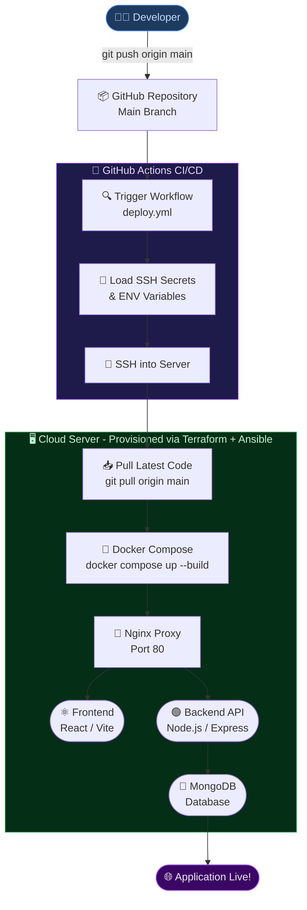
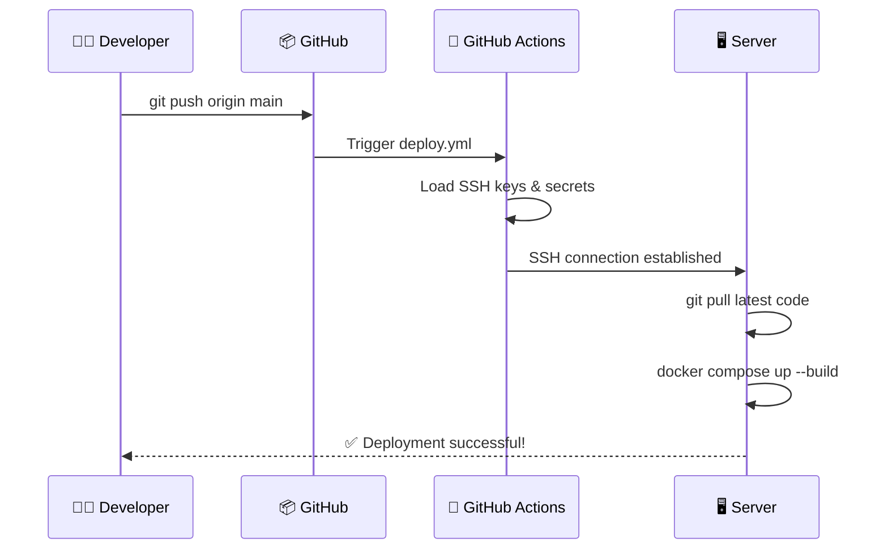

<div align="center">

<!-- TOP WAVE -->


<!-- BADGES -->
<p>
  
  
  
  
  
  
  
  
</p>

<p>
  
  
  
  
  
</p>

<br/>

> 🚀 **A production-grade DevOps platform** demonstrating containerized deployments, infrastructure as code, automated CI/CD, and reverse proxy — all wired together in one cohesive project.

<br/>

</div>

---

## 📌 Table of Contents

- [🏗 Project Architecture](#-project-architecture)
- [⚙️ Deployment Pipeline](#️-deployment-pipeline)
- [🛠 Tech Stack](#-tech-stack)
- [📁 Project Structure](#-project-structure)
- [🚀 Getting Started](#-getting-started)
- [📡 API Endpoints](#-api-endpoints)
- [🌍 Terraform Infrastructure](#-terraform-infrastructure)
- [🤖 Ansible Configuration](#-ansible-server-configuration)
- [🔄 CI/CD Pipeline](#-cicd-deployment)
- [✨ Features](#-features)
- [🔮 Future Improvements](#-future-improvements)

---

## 🏗 Project Architecture

<div align="center">

```
┌─────────────────────────────────────────────────────────────┐
│                        User Browser                         │
│                     🌐 http://localhost                      │
└───────────────────────────┬─────────────────────────────────┘
                            │
                            ▼
┌─────────────────────────────────────────────────────────────┐
│              🔀  Nginx  (Reverse Proxy :80)                 │
└──────────────┬──────────────────────────┬───────────────────┘
               │                          │
               ▼                          ▼
┌──────────────────────┐    ┌─────────────────────────────┐
│  ⚛️  React Frontend  │    │  🟢 Node.js + Express API   │
│     (Vite Build)     │    │   JWT Auth  •  REST Routes  │
└──────────────────────┘    └──────────────┬──────────────┘
                                           │
                                           ▼
                            ┌─────────────────────────┐
                            │  🍃  MongoDB Database   │
                            │  Users  •  Collections  │
                            └─────────────────────────┘
```

</div>

---

## ⚙️ Deployment Pipeline

<div align="center">



</div>

---

## 🛠 Tech Stack

<div align="center">

| Layer | Technology | Purpose |
|:------|:----------:|:--------|
| 🖥️ **Frontend** |   | UI & Fast Bundling |
| 🔧 **Backend** |   | REST API Server |
| 🔐 **Auth** |  | Authentication |
| 🗄️ **Database** |  | NoSQL Storage |
| 🔀 **Proxy** |  | Reverse Proxy |
| 🐳 **Containers** |  | Containerization |
| 🌍 **IaC** |  | Cloud Provisioning |
| 🤖 **Config** |  | Server Setup |
| 🔄 **CI/CD** |  | Auto Deployment |

</div>

---

## 📁 Project Structure

```
dockstack-devops-platform/
│
├── 🟢 backend/
│   ├── controllers/       ← Route logic & business rules
│   ├── models/            ← Mongoose schemas
│   ├── routes/            ← Express route definitions
│   ├── config/            ← DB config, env setup
│   └── server.js          ← App entry point
│
├── ⚛️  frontend/
│   └── src/               ← React components & pages
│
├── 🐳 docker/
│   ├── Dockerfile.backend
│   ├── Dockerfile.frontend
│   └── docker-compose.yml ← Orchestrates all services
│
├── 🔀 nginx/
│   └── default.conf       ← Reverse proxy routing rules
│
├── 🌍 terraform/
│   ├── main.tf            ← Cloud resource definitions
│   └── variables.tf       ← Configurable inputs
│
├── 🤖 ansible/
│   └── setup.yml          ← Installs Docker, Git on server
│
└── 🔄 .github/
    └── workflows/
        └── deploy.yml     ← Auto-deploy on main push
```

---

## 🚀 Getting Started

### Prerequisites

Make sure the following are installed on your machine:


### 1️⃣ Clone the Repository

```bash
git clone https://github.com/yourusername/dockstack-devops-platform.git
cd dockstack-devops-platform
```

### 2️⃣ Launch with Docker Compose

```bash
docker compose -f docker/docker-compose.yml up --build
```

### 3️⃣ Open in Browser

```
http://localhost
```

> 🟢 All services — Frontend, Backend, MongoDB, and Nginx — start together automatically.

---

## 📡 API Endpoints

<div align="center">

| Method | Endpoint | Description | Auth Required |
|:------:|:---------|:------------|:-------------:|
| `GET` | `/api/health` | Health check | ❌ |
| `POST` | `/api/auth/register` | Register new user | ❌ |
| `POST` | `/api/auth/login` | Login & get JWT token | ❌ |

</div>

**Example Request — Register User:**

```bash
curl -X POST http://localhost/api/auth/register \
  -H "Content-Type: application/json" \
  -d '{"username": "akshat", "password": "securepass123"}'
```

**Example Response:**

```json
{
  "message": "User registered successfully",
  "token": "eyJhbGciOiJIUzI1NiIsInR5cCI6..."
}
```

---

## 🌍 Terraform Infrastructure

> Provisions a cloud server ready for Docker deployments.

```bash
# Step 1 — Initialize Terraform
cd terraform
terraform init

# Step 2 — Preview infrastructure changes
terraform plan

# Step 3 — Apply and create the server
terraform apply
```

```
terraform apply output:
  ✅  aws_instance.dockstack_server: Creation complete
  ✅  Public IP: 54.xxx.xxx.xxx
  ✅  Apply complete! Resources: 2 added, 0 changed, 0 destroyed.
```

---

## 🤖 Ansible Server Configuration

> Automatically installs Docker, Git, and other dependencies on your server.

```bash
ansible-playbook setup.yml
```

```yaml
# ansible/setup.yml (overview)
- Install Docker & Docker Compose
- Install Git
- Configure firewall rules
- Enable Docker service on boot
```

---

## 🔄 CI/CD Deployment

> Push to `main` → application is live. Zero manual steps.



**Required GitHub Secrets:**

| Secret | Description |
|:-------|:------------|
| `SSH_PRIVATE_KEY` | Private key for server access |
| `SERVER_IP` | Your cloud server IP |
| `SSH_USER` | Server username (e.g. `ubuntu`) |

---

## ✨ Features

<div align="center">

| Feature | Status |
|:--------|:------:|
| Full Stack Web Application (React + Node.js) | ✅ |
| Docker Containerization | ✅ |
| Nginx Reverse Proxy | ✅ |
| MongoDB Database | ✅ |
| JWT Authentication | ✅ |
| Infrastructure as Code (Terraform) | ✅ |
| Server Configuration (Ansible) | ✅ |
| Automated CI/CD Deployment | ✅ |

</div>

---

## 🔮 Future Improvements

```
🔜  Kubernetes Deployment         — Container orchestration at scale
🔜  Prometheus & Grafana          — Metrics, dashboards & alerting
🔜  Redis Caching                 — Faster reads, session management
🔜  HTTPS with Let's Encrypt      — Free SSL/TLS certificates
🔜  Custom Domain Configuration   — Production-ready URLs
```

---

## 👨‍💻 Author

<div align="center">


### Akshat Srivastava
*Built with ❤️ and a lot of `docker compose up`*

</div>

---

<div align="center">

⭐ **If this project helped you, please give it a star!** ⭐

<br/>

<!-- BOTTOM WAVE -->


</div>
